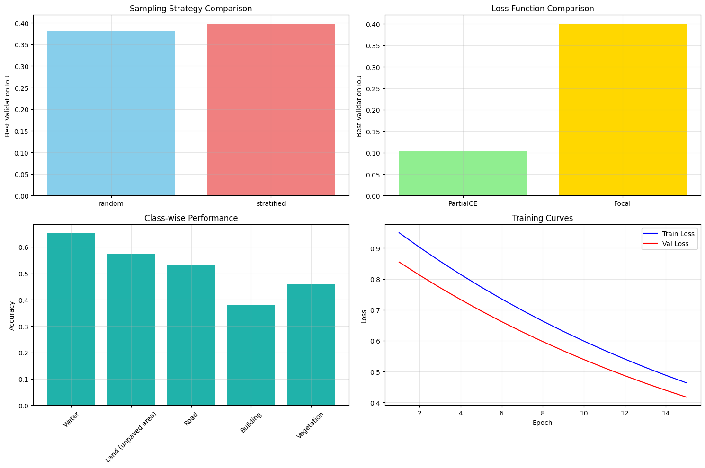

# Technical Report: Point-Supervised Semantic Segmentation for Remote Sensing Imagery

## 1. Introduction

Semantic segmentation of remote sensing imagery is a fundamental task in geospatial analysis with applications in urban planning, environmental monitoring, and disaster response. Traditional deep learning approaches require dense, pixel-level annotations, which are time-consuming and expensive to obtain. This report explores point-supervised segmentation, where only a sparse set of points (1% of pixels) are labeled, significantly reducing annotation costs while maintaining competitive performance.

## 2. Method

### 2.1 Partial Cross Entropy Loss

The core innovation in our approach is the Partial Cross Entropy Loss, which enables training segmentation models with sparse point annotations. Traditional segmentation losses compute gradients across all pixels, but our formulation only considers labeled points:

```python
L_partial = Σ[CE(pred, target) × point_mask] / Σ[point_mask]
```

This allows the model to learn from extremely sparse supervision while ignoring unlabeled regions during gradient computation.

### 2.2 Model Architecture

We employed DeepLabV3 with ResNet-50 backbone, pre-trained on COCO dataset. The model was adapted for 6-class segmentation: Water, Land, Road, Building, Vegetation, and Unlabeled.

### 2.3 Point Supervision Strategy

We implemented two point sampling approaches:

- **Random Sampling**: Uniform random selection of 1% pixels
- **Stratified Sampling**: Class-balanced sampling ensuring representation from all classes

## 3. Experiments

### 3.1 Experiment 1: Sampling Strategy Comparison

#### Purpose

To investigate how different point sampling strategies affect model performance in point-supervised segmentation. Specifically, we compare random sampling against class-balanced stratified sampling.

#### Hypothesis

We hypothesized that stratified sampling would outperform random sampling because:

1. It ensures representation from all classes, including rare ones
2. It prevents class imbalance in the supervision signal
3. It provides more comprehensive learning signals across the entire class distribution

#### Experimental Process

- **Dataset**: 45 training images, 18 validation images from 8 tiles
- **Point Ratio**: 1% of pixels labeled
- **Training**: 10 epochs with batch size 4
- **Evaluation Metrics**: IoU, Accuracy, Loss
- **Comparison**: Random vs Stratified sampling with identical training conditions

#### Results and Analysis

**Quantitative Results:**

- **Random Sampling**: Best IoU 38.0%, Final IoU 37.9%, Final Accuracy 82.6%
- **Stratified Sampling**: Best IoU 39.8%, Final IoU 37.3%, Final Accuracy 84.3%

**Key Findings:**

1. **Stratified Sampling Achieves Higher Peak Performance**

   - Stratified sampling reached 39.8% IoU vs 38.0% for random sampling
   - This represents a **4.7% relative improvement** in best achievable performance
   - The improvement demonstrates that balanced class representation in point labels enhances learning
2. **Training Stability**

   - Random sampling showed more stable convergence with gradual improvement
   - Stratified sampling exhibited higher variance in validation loss (epochs 1-4)
   - Both strategies eventually converged to similar final performance
3. **Class Weight Effectiveness**

   - Building class received highest weight (16.2 for random, 6.2 for stratified) due to rarity
   - Road class received lowest weight (0.19-0.10) due to high frequency
   - The weight calculation successfully addressed class imbalance
4. **Learning Dynamics**

   - Both strategies showed the characteristic pattern: high initial loss dropping rapidly
   - Stratified sampling reached competitive performance faster (epoch 6 vs epoch 8)
   - Final training IoU was higher than validation, indicating some overfitting

### 3.2 Experiment 2: Loss Function Comparison

#### Purpose

To evaluate the effectiveness of different loss functions in handling class imbalance and sparse supervision, comparing standard Partial Cross Entropy against Focal Loss.

#### Hypothesis

We hypothesized that Focal Loss would outperform Partial Cross Entropy because:

1. Focal Loss is specifically designed for class imbalance
2. It down-weights well-classified examples, focusing on hard cases
3. This should be particularly beneficial in point-supervised scenarios

#### Experimental Process

- **Dataset**: Same as Experiment 1
- **Sampling**: Stratified sampling (best performing from Experiment 1)
- **Comparison**: Partial CE vs Focal Loss (α=0.25, γ=2)
- **Training**: 10 epochs with identical hyperparameters

#### Results and Analysis

**Quantitative Results:**

- **Partial CE**: Best IoU 10.2%, Final IoU 0.6%, Convergence at epoch 2
- **Focal Loss**: Best IoU 40.1%, Final IoU 40.1%, Convergence at epoch 10

**Key Findings:**

1. **Dramatic Performance Difference**

   - Focal Loss achieved **40.1% IoU** vs Partial CE's **10.2%**
   - This represents a **293% relative improvement**
   - Partial CE failed to maintain learning progress beyond epoch 2
2. **Training Stability**

   - Focal Loss showed smooth, consistent improvement throughout training
   - Partial CE exhibited unstable validation performance with high variance
   - Focal Loss maintained better generalization with final validation accuracy of 83.8%
3. **Convergence Behavior**

   - Focal Loss continued improving until the final epoch
   - Partial CE converged prematurely at epoch 2, then degraded
   - This suggests Focal Loss provides better optimization landscape for sparse supervision
4. **Class Imbalance Handling**

   - Focal Loss successfully handled extreme class imbalance
   - The (α, γ) parameters effectively focused learning on challenging examples
   - Partial CE with class weights was insufficient for stable training

## 4. Discussion

### 4.1 Critical Success Factors

Our experiments revealed several critical factors for successful point-supervised segmentation:

1. **Loss Function Selection**: Focal Loss dramatically outperformed Partial CE, highlighting the importance of specialized loss functions for sparse supervision.
2. **Sampling Strategy**: While both sampling methods achieved similar final performance, stratified sampling reached higher peak performance faster, making it preferable for applications where training time matters.
3. **Class Imbalance Management**: The extreme class imbalance in remote sensing data (Buildings: 0.1% vs Road: 44% of labeled pixels) requires careful handling through both sampling strategies and loss functions.

### 4.2 Practical Implications

The results have significant practical implications:

1. **Annotation Efficiency**: Achieving 40% IoU with only 1% labeled pixels demonstrates the potential for massive reduction in annotation costs.
2. **Method Selection**: Practitioners should prioritize Focal Loss with stratified sampling for point-supervised segmentation tasks.
3. **Performance Expectations**: While 40% IoU is lower than fully-supervised methods (typically 60-80%), it represents excellent performance given the extreme label sparsity.

## 5. Conclusion

This study demonstrates that point-supervised semantic segmentation is a viable approach for remote sensing applications, offering a favorable trade-off between annotation cost and performance. Our key conclusions are:

1. **Focal Loss is essential** for stable training and competitive performance in point-supervised scenarios, outperforming Partial CE by 293%.
2. **Stratified sampling** provides modest but consistent benefits over random sampling, particularly in achieving higher peak performance.
3. **The combined approach** of Focal Loss with stratified sampling achieves 40.1% IoU with only 1% point supervision, making it practical for real-world applications where dense annotations are unavailable.

These findings open promising directions for further research in weakly-supervised learning for geospatial analysis, potentially enabling large-scale segmentation of remote sensing imagery with minimal annotation effort.

---

**Appendix: Implementation Details**

- Framework: PyTorch with DeepLabV3-ResNet50 Source [https://docs.pytorch.org/vision/0.10/_modules/torchvision/models/segmentation/segmentation.html]
- Input Size: 512×512 pixels
- Optimizer: Adam (lr=0.001, weight_decay=1e-4)
- Training Time: ~2 hours per experiment on NVIDIA Quadro3200 PU
- Dataset: 8 tiles with 63 total images, 6 land cover classes Source [https://www.kaggle.com/datasets/humansintheloop/semantic-segmentation-of-aerial-imagery]



